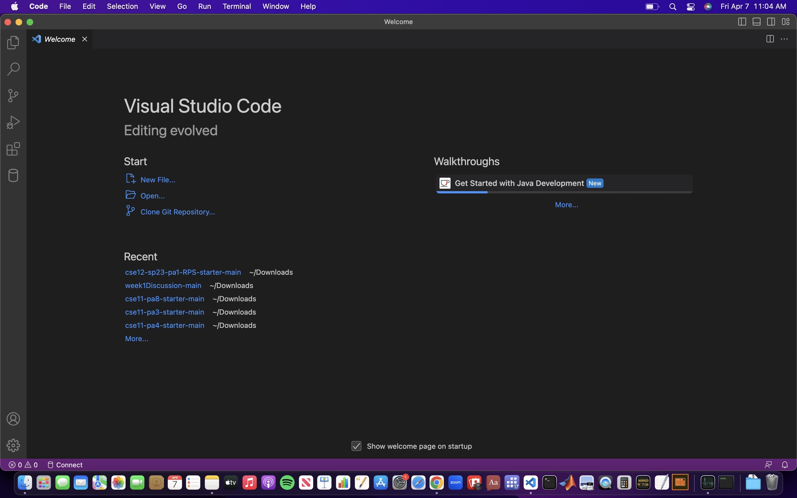
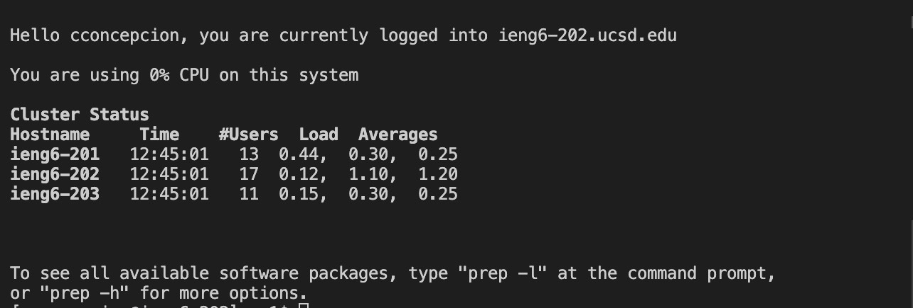
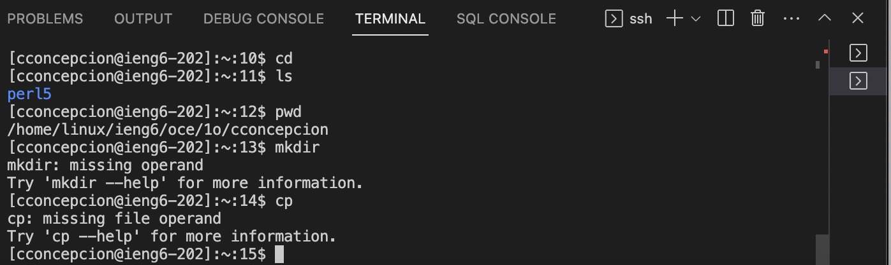

**Lab Report 1**
******************
To Get Started: 
Step 1: Download and Install VSCode [Here](https://code.visualstudio.com/) Versions for both Mac and Windows
after you have installed it you should see the application open like this 

Step 2: Windows Users: - install git for windows [Here](https://gitforwindows.org/)
        Windows Users: - use default terminal to use git bash in VSCode [Here](https://stackoverflow.com/questions/42606837/how-do-i-use-bash-on-windows-from-the-visual-studio-code-integrated-terminal/50527994#50527994)
        Mac Users: - use ssh by opening the terminal on VSCode then inputing $ ssh cs15lsp23zz@ieng6.ucsd.edu (the zz is replaced with course specific account letters.
        Mac Users: - you will be asked to authenticate; type yes. 
        Mac Users: - you will enter the password created specific to your course specific account letters. 
        Mac Users: - you are now connected to your course account. 
        Result of server should look like this 

Step 3: Run commands such as cd , ls , pwd , mkdir , and cp and observe the commands you see in the terminal. 
        Output picture shoud look like this  

